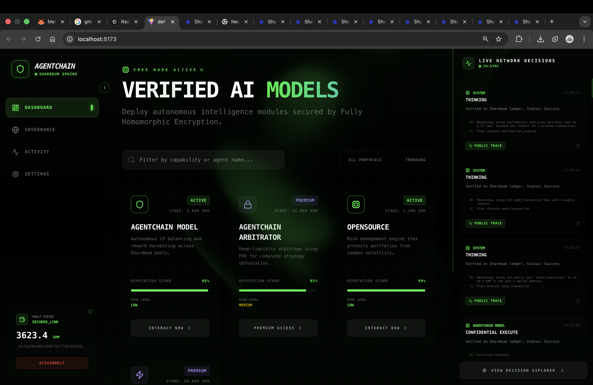
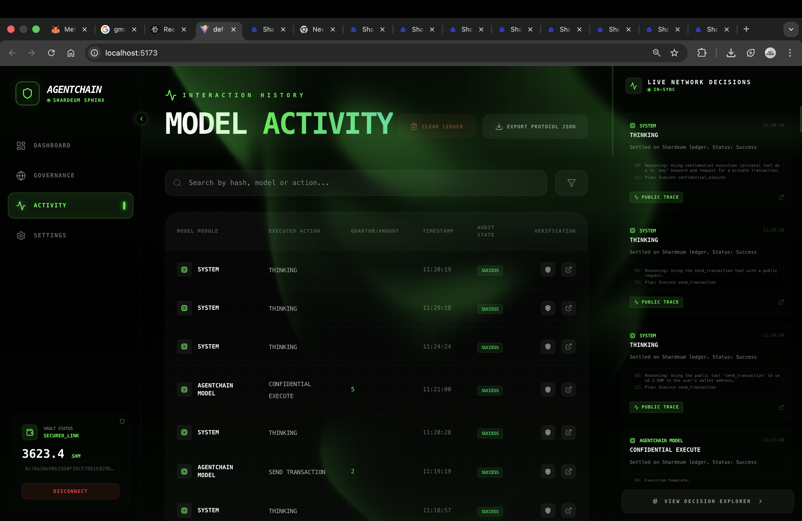
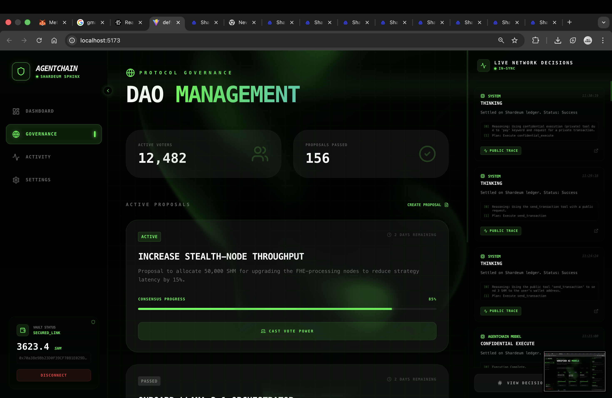
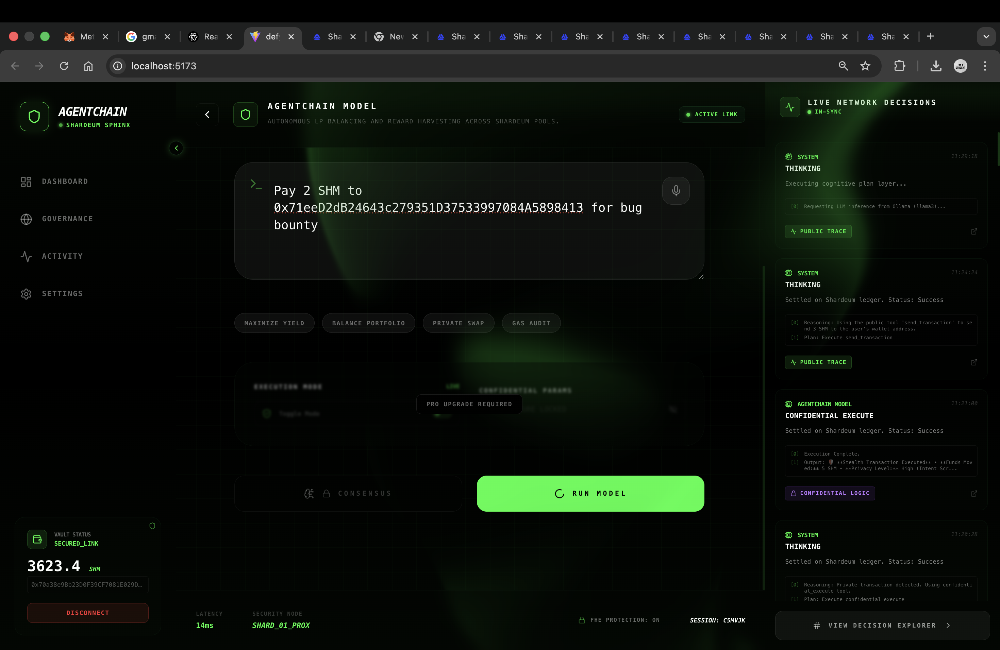
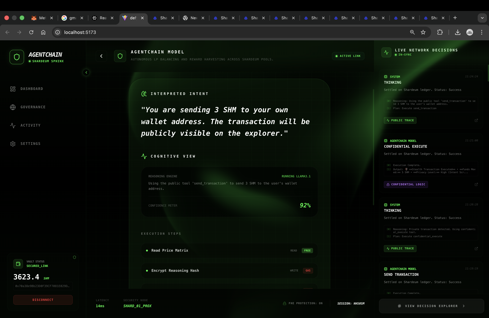
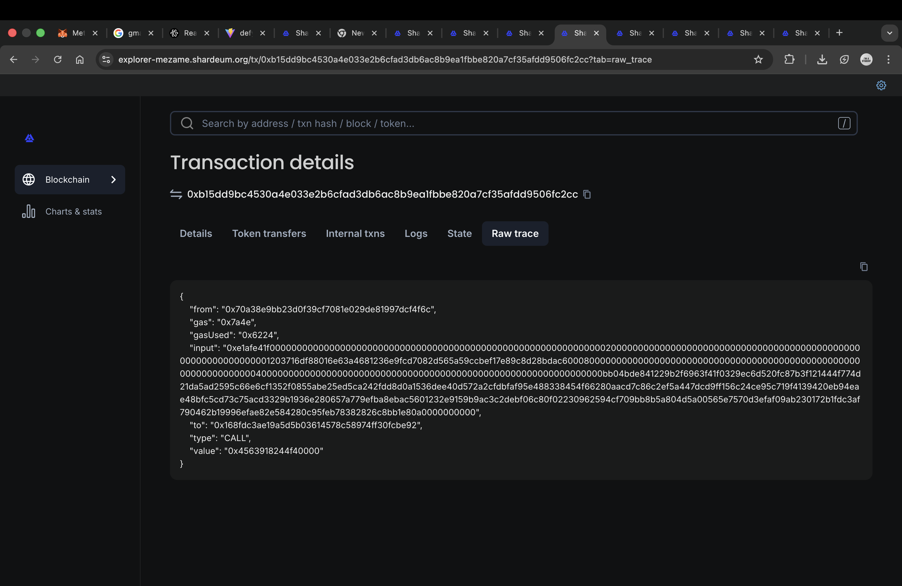
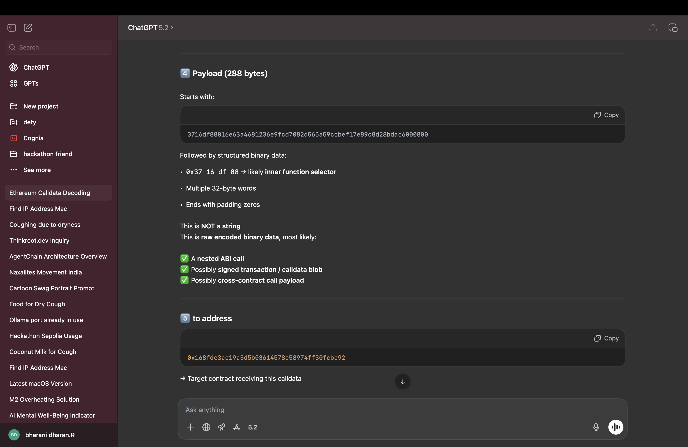
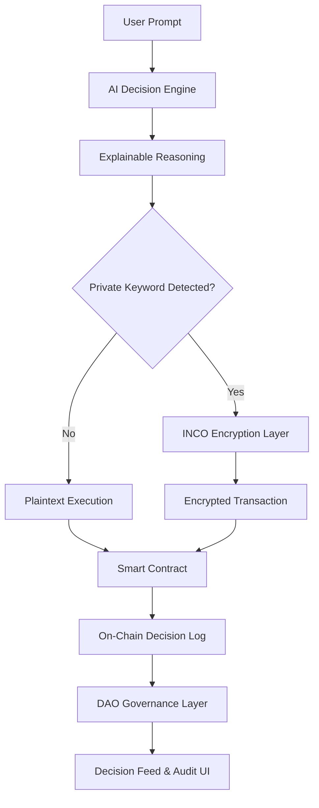

# 🧠⛓️ AgentChain

## Transparent, DAO-Governed AI Agents for Auditable Decision-Making

**Hackathon / Demo Edition**

<div align="center">


**AI agents shouldn’t be black boxes. They should be auditable, governable, and explainable.**

</div>

---

## 🎥 Product Demo

```
https://agentchain-explorer-cvevos.thinkroot.app/
```

<div align="center">
  
</div>

---

## 🖼️ Application Preview


<div align="center">
















</div>


---

## 🎯 Overview

**AgentChain** is a web application where an AI-powered trading agent produces **explainable decisions**, anchored on-chain and governed by a DAO.

Instead of blindly trusting automation, users can **inspect AI reasoning, verify execution on-chain, and understand governance approval paths** — while preserving privacy when required.

AgentChain demonstrates how autonomous AI systems should operate in decentralized environments: transparent by default, private when requested, and always accountable.

---

## 🚨 Problem

Most AI trading agents today are opaque and unaccountable.

### What’s broken:

* Users cannot see what data the AI analyzed
* Decisions occur off-chain with no immutable audit trail
* Logs are centralized and mutable
* No governance or approval mechanism exists

As AI agents become more autonomous, **DAOs require mechanisms to trust, audit, and control them**.

---

## 🚀 Solution: AgentChain

AgentChain introduces a **governance-first AI agent framework** where:

* AI reasoning is **structured, explainable, and visible**
* Every decision produces **verifiable on-chain metadata**
* Agents require **DAO approval** before operating
* Strategy-sensitive parameters remain **selectively private**

This creates a balance between:

**automation × transparency × governance**

---

## ⭐ Key Features

### 🧠 Explainable AI Decisions

Every **Buy / Sell / Hold** decision includes:

* Observed inputs
* Reasoning summary
* Alternatives considered
* Risks acknowledged

Optional **text-to-speech narration** improves accessibility and demo clarity.

---

### 📜 Auditable Decision Logs

Each decision generates:

* Decision hash
* Input data hash
* Timestamp

These logs are displayed in an **explorer-style interface**, directly referencing on-chain data for independent verification.

---

### 🏛️ DAO Governance Layer

* AI agents cannot operate without DAO approval
* DAO members vote to approve or reject agents
* Agent activation status updates automatically

Governance is not an afterthought — it is a **core control layer**.

---

### 🔐 Confidential Transactions via INCO

AgentChain supports **intent-based confidential execution** using INCO’s encryption layer.

If a user includes the keyword **"private"** in their prompt:

* Sensitive transaction parameters are encrypted before execution
* Encrypted calldata is submitted on-chain
* Execution remains verifiable
* Internal logic and values are unreadable to external observers

This enables:

* Strategy privacy
* Confidential transaction amounts
* Verifiable yet opaque execution

Public observers see **proof of execution**, while authorized compute operates on encrypted data.

---

### 📊 Reputation & Performance Tracking

Each AI agent maintains:

* Reputation score
* Historical performance view
* Win / Loss ratio
* Consistency score
* Audit flags for anomalous behavior

Trust is earned over time, not assumed.

---

## 👥 User Roles

| Role                 | Capabilities                                 |
| -------------------- | -------------------------------------------- |
| **Public User**      | View decisions, summaries, and proofs        |
| **DAO Member**       | Vote on agents and audit deeper explanations |
| **Admin / Operator** | Configure agents and monitor system behavior |

---

## 🖥️ Application Pages

* **Landing Page** – Product overview and system flow
* **Dashboard** – Agent status and summaries
* **Decision Feed** – Chronological AI decisions
* **Decision Explanation Modal** – Deep explainability
* **DAO Governance** – Voting and activation control
* **Reputation Page** – Performance and trust metrics

---

## 🔄 System Workflow



### Flow Summary

1. User submits a natural language prompt
2. AI generates a structured decision and explanation
3. Privacy intent is detected from the prompt
4. Parameters are optionally encrypted using INCO
5. Transaction is executed on-chain
6. Decision is logged immutably
7. DAO governs agent activation
8. Users inspect results via the UI

---

## ⛓️ Smart Contract

AgentChain operates with a **deployed smart contract** serving as the immutable execution and audit anchor.

**Contract Address:**

```
0x04AbE123D31971575Cd94850752f2C59faf92a26
```

This contract anchors:

* AI decision records
* Execution proofs
* Governance accountability
* On-chain auditability

---

## 🛠️ Technology Stack

### Frontend

* React.js
* TailwindCSS
* Web3-style UI patterns

### Backend / Logic

* Node.js
* AI decision engine
* MCP-style structured data access

### Web3

* On-chain decision anchoring
* DAO governance concepts
* Wallet-based identity

---

## 🤝 Sponsor Integrations

### ThinkRoot

* Rapid UI scaffolding
* Governance and explainability views
* Fast iteration from concept to demo

### Inco

* Confidential execution layer
* Encrypted on-chain parameters
* Selective transparency by design

---

## ▶️ Running the Project

```bash
npm install
npm run dev
```
