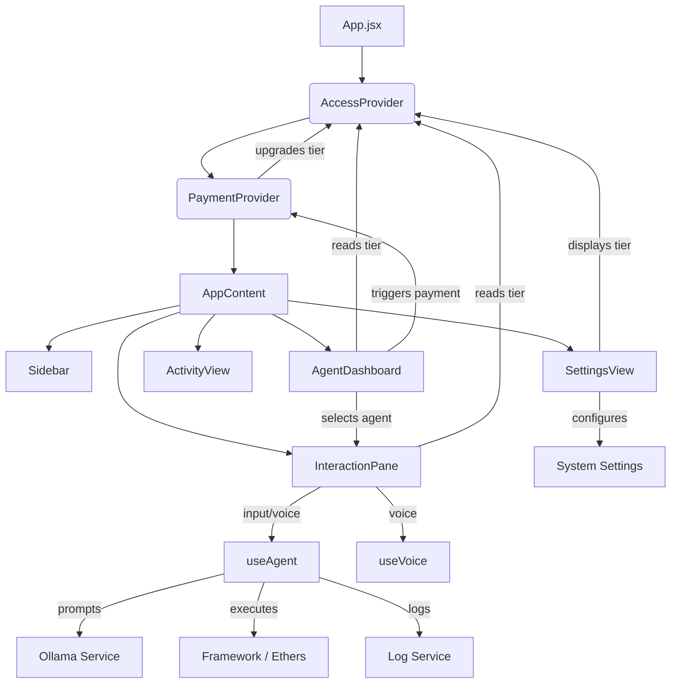

# AgentChain System Architecture and Workflow Documentation

**Version:** 1.0  
**Date:** 2026-01-13  
**Status:** Live / Beta  

---

## 1. Executive Summary

**AgentChain** is a next-generation decentralized AI trading terminal designed to bridge the gap between natural language intent and on-chain execution. It operates on the **Shardeum** blockchain for high-throughput settlement and integrates **Inco Network** for Fully Homomorphic Encryption (FHE), allowing for confidential strategy execution.

The platform distinguishes itself through a "Safety-First" architecture, employing a robust **Access Control System (ACS)** that categorizes nodes into **FREE** and **PRO** tiers. It features a unique **Simulation Sandbox** that allows users to test AI-generated strategies without risking funds, and a **Consensus Roundtable** where multiple AI models debate the optimal path for a user's intent.

This document serves as a comprehensive technical and operational guide, detailing every feature, workflow, and the intricate web of connections between the frontend, AI extraction layer, and blockchain protocols.

---

## 2. Core Architecture

The system is built on a modular stack designed for scalability and security.

### 2.1 The Frontend Layer (React + Vite)
The interaction layer is built with **React** and **TailwindCSS**, utilizing a "Cyber-Noir" aesthetic (Black/Green/Purple) to evoke a professional terminal environment.
*   **Entry Point (`App.jsx`)**: The substantial root component. It wraps the entire application in global context providers (`AccessProvider`, `PaymentProvider`) and renders the `Plasma` background effect using `ogl` for a dynamic, living backdrop.
*   **Routing**: The app uses a state-based navigation system (Dashboard <-> Interaction Pane <-> Settings) rather than URL routing to maintain a seamless "single-session" terminal feel.

### 2.2 The Cognitive Layer (Ollama + Llama 3)
Intelligence is derived from a local LLM instance (Ollama running Llama 3).
*   **Prompt Engineering**: The **System Prompt** in `useAgent.js` is strictly engineered to force the LLM into a JSON-only output mode. It is forbidden from conversational filler, ensuring predictable downstream parsing.
*   **Context Injection**: Every prompt is prefixed with real-time state: `User Wallet Address`, `Current Network`, and `Available Tools`.

### 2.3 The Execution Layer (Node.js + Ethers + MCP)
*   **The Gateway**: A Node.js middleware that facilitates communication between the React frontend and the local AI models.
*   **MCP (Model Context Protocol)**: Defined in `mcp-tools.js`, this standardizes the tools available to the AI (e.g., `send_transaction`, `check_liquidity`, `confidential_execute`).
*   **Smart Contract Interaction**: Uses `ethers.js` to communicate with the Shardeum RPC. It handles signing, gas estimation, and transaction broadcasting.

---

## 3. The Access Control System (ACS)

The **ACS** is the governing logic of the application, defined in `AccessContext.jsx`. It bifurcates the user base to monetize advanced features while keeping core functionality accessible.

### 3.1 Tier Definitions
*   **FREE NODE**:
    *   **Capabilities**: Basic single-agent interaction, Live execution mode only, Public transaction ledger.
    *   **Restrictions**: No Simulation Mode, No Consensus Roundtable, No Confidential Parameters.
*   **PRO NODE (Institutional)**:
    *   **Capabilities**: Simulation Sandbox (Default), Multi-Agent Consensus, FHE Encryption, Priority Execution, Custom Risk Limits.

### 3.2 System Linkage
The `useAccess()` hook exposes the `tier` state (`FREE` | `PRO`) to all components.
*   **In `AgentDashboard`**: The header reads `tier` to display the "FREE NODE ACTIVE" or "PRO NODE ACTIVE" badge.
*   **In `InteractionPane`**: Feature buttons (Consensus, Toggle Mode) check `tier`. If a FREE user clicks "Consensus", an error state is triggered via `setAccessError`, displaying a lock notification.
*   **In `PaymentContext`**: The `PaymentProvider` imports `useAccess`. Upon a successful payment callback (`onSuccess`), it triggers the `upgradeToPro()` function, instantly elevating the session privileges.

---

## 4. Comprehensive Workflow Guide

### 4.1 Workflow A: User Onboarding & Connection
1.  **Launch**: User opens the app. The `Plasma` background initializes.
2.  **Wallet Connect**: User connects MetaMask. `useAgent` captures the address (`signer`) to inject into the AI context.
3.  **Tier Check**: System defaults to `AccessContext` -> FREE. The Dashboard displays the "FREE NODE" indicator.

### 4.2 Workflow B: The "Thinking" Process (Intent to Action)
1.  **Selection**: User selects an Agent (e.g., "Yield Sentinel") from the Dashboard.
2.  **Prompt**: User enters "Buy 100 SHM" or uses Voice Command.
3.  **Cognition**:
    *   Request sent to `useAgent` -> `processPrompt`.
    *   `log-service.js` records a "THINKING" state.
    *   Ollama analyzes prompt + context.
4.  **Decision**:
    *   AI returns JSON: `{ tool: 'send_transaction', params: { amount: 100 } }`.
    *   UI displays the "Cognitive View" (Reasoning + Confidence Score).

### 4.3 Workflow C: Simulation Mode (PRO Feature)
1.  **Activation**: PRO User toggles "Execution Mode" to **SIMULATE**.
2.  **Interception**: User clicks "Run Simulation".
3.  **Simulated Logic (`useAgent.js`)**:
    *   The `executeTool` function detects `isSimulation = true`.
    *   **It halts on-chain submission.**
    *   It generates high-fidelity mock data: "Gas: 2100 Gwei", "Risk: Low", "Liquidity: High".
    *   It returns a formatted "SIMULATED — NO FUNDS MOVED" report.
4.  **Transition**: User is satisfied. Toggles to **LIVE**. Button turns Green ("Confirm Live Transaction"). Execution proceeds on-chain.

### 4.4 Workflow D: Consensus Roundtable (PRO Feature)
1.  **Trigger**: User clicks "Consensus" or types "Strategy".
2.  **Gate Check**: `InteractionPane` verifies `tier === PRO`.
3.  **Roundtable View**: The main input view is swapped for the Consensus View.
    *   Three distinct model cards appear (Yield Sentinel, Stealth Arbitrator, Neural Quant).
    *   Each displays a unique, pre-calculated Risk/Confidence profile.
4.  **Selection**: User clicks "Select Model" on the "Stealth Arbitrator".
5.  **Alignment**: The interaction prompt is pre-filled with that model's specific strategy protocol.

### 4.5 Workflow E: Payment & Upgrade
1.  **Trigger**: FREE User clicks "Premium Access" on a locked model or "Request Upgrade" in Settings.
2.  **Modal**: `PaymentModal` opens (Fintech V.1 Interface).
3.  **Input**: User performs mock Card/UPI entry.
4.  **Processing**: A generic loading bar simulates gateway verification (2 seconds).
5.  **Success Callback**:
    *   `PaymentModal` calls `onSuccess` prop.
    *   `PaymentContext` executes `upgradeToPro()`.
    *   `AccessContext` state updates to `PRO`.
    *   UI immediately updates (Badge changes to Purple, Locks dissolve).

---

## 5. Feature Deep Dive & Linkage

### 5.1 Voice Command Center
*   **File**: `useVoice.js`
*   **Linkage**: Connected to `InteractionPane`.
*   **Functionality**: Uses the Web Speech API to transcribe audio to text (`transcript`) and inject it into the `prompt` state. It also utilizes `window.speechSynthesis` for the AI to "Speak" its plans back to the user (`speak()`).

### 5.2 The Plasma Backdrop
*   **File**: `Plasma.jsx`
*   **Linkage**: Rendered in `App.jsx` at z-index 0.
*   **Tech**: Uses `ogl` (WebGL) for performant, GPU-accelerated fluids.
*   **Effect**: Provides the "living" green slime/energy field that defines the app's visual identity.

### 5.3 Confidential Execution (FHE)
*   **File**: `useAgent.js` (Tool ID: `confidential_execute`)
*   **Linkage**: Activated when AI selects the `confidential_execute` tool.
*   **Tech**: Integrates logic for **Inco Network**.
*   **Flow**:
    1.  User asks for "Private trade".
    2.  AI selects confidential tool.
    3.  User inputs masked parameters (Risk Tolerance).
    4.  System calls `inco-service` (mocked) to encrypt parameters.
    5.  Encrypted blob is sent to the blockchain.
    6.  Explorers see the transaction content as "0x..." gibberish, preserving intent privacy.

### 5.4 Activity Logging Ledger
*   **File**: `log-service.js` & `ActivityView.jsx`
*   **Linkage**: `useAgent` calls `addLog` / `updateLog` at every step.
*   **Persistence**: Uses `localStorage` to save the "Chain of Thought" even after page reload.
*   **Function**: Allows users to audit the AI. They can see exactly what the AI "thought" vs what it "did".

---

## 6. Technical Dependency Map

How the files communicate:

### Key Functional Links:
1.  **AI -> Tool**: The JSON parsing in `useAgent` is the critical bridge. It converts fuzzy LLM text into strict execution commands that the `InteractionPane` can act upon.
2.  **Tier -> Feature**: The `tier` variable in `AccessContext` is the master key. It is subscribed to by almost every major component to toggle visibility of `
`s and `<button>`s.
3.  **Payment -> Context**: The `PaymentModal` is "dumb"—it just processes money. It relies on the `PaymentContext` to tell it *what* to do after success (via the function passed to `onSuccess`), which is to call the `AccessContext`.

---

## 7. Conclusion

AgentChain is not just a UI; it is a state-managed, multi-layered application that orchestrates complex interactions between the user, local AI, and public blockchains. By strictly separating concerns (Reasoning vs Execution, Free vs Pro), it creates a safe, simplified, and gamified experience for sophisticated DeFi operations.
